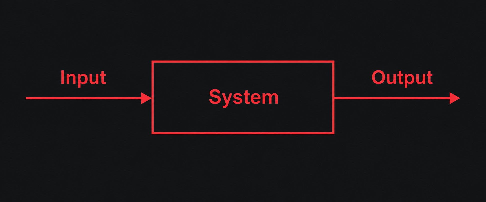

# OpenWorkgraph

OpenWorkgraph is a software development workflow product built around the infinite canvas concept, with support for organizing work and collaborating across other fields.

[简体中文](README.md) | English

## Quick Start

Open the [official OpenWorkgraph editor](https://workgraph.giarld.com/) and follow the on-screen setup guide to get started.

## Design Philosophy: First Principles



## Build and Run Locally

### Agent Service

Build the protocol package and Agent Service from the repository root:

```sh
npm run build
```

After the build completes, run Agent Service in the foreground:

```sh
node agent-service/dist/cli.js start
```

### Web Client

Build Web Client from the repository root, then serve the production build with Vite Preview at `http://127.0.0.1:4173`:

```sh
npm --prefix web-client run build
npm --prefix web-client run preview -- --host 127.0.0.1 --port 4173
```

After opening Web Client, enter the Workspace address and click “Generate client code.” Run the following command on the machine hosting the Workspace, using the 8-digit client code shown in the browser. Verify the origin and public key fingerprint before approving. The browser polls for approval, proves possession of the private key, exchanges communication credentials, and then connects automatically:

```sh
node agent-service/dist/cli.js pair --client-code '<client-code>'
```

The client code consists of 8 consecutive digits, such as `12345678`, with no spaces, and expires after 5 minutes. By default, the terminal displays a human-readable approval result in English. Add `--output-json` only when a script needs to parse the result; non-interactive approval also requires `--yes`.

Only one service runs per machine. The `--data-dir` option is available only for `start` and `serve`. After a successful start, the directory is remembered automatically, so pairing, status, stop, logs, and backup commands do not need it. Running `start` after stopping the service reuses the previous directory. On the first start, if no directory is specified, the default is `.openworkgraph` in the user's home directory. Attempts to start a second service are explicitly rejected; there is no service selection or switching step.

You do not need to enter `--origin` manually. HTTPS is not required, and plain HTTP is supported on trusted local networks. HTTP traffic is unencrypted; do not expose it to the public internet.

### Checks and Tests

```sh
npm test
npm --prefix web-client run typecheck
npm --prefix web-client test
npm --prefix web-client run build
npm --prefix web-client run test:e2e
```

Run these commands from the repository root. The Web build output is written to `web-client/dist/`, and browser tests use an installed copy of Chrome.

## References and Acknowledgments

The Web UI draws on the visual style and canvas interactions of [basketikun/infinite-canvas](https://github.com/basketikun/infinite-canvas). Thanks to the original author, basketikun. That project is licensed under the [MIT License](https://github.com/basketikun/infinite-canvas/blob/d213a74614e0e4bd8a26383d1e1e907249e9c61b/LICENSE). When reusing its code or other applicable content, retain the original copyright and license notices. Third-party assets with separate licenses remain subject to their respective terms.

## License

This project is licensed under the [MIT License](LICENSE). Copyright and license notices for third-party sources are retained with their original attribution.
